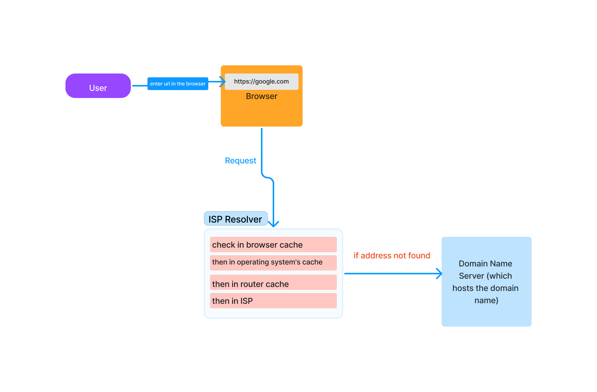
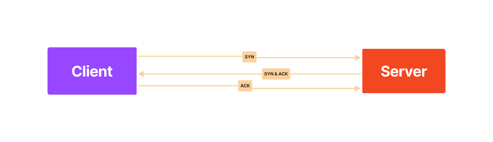
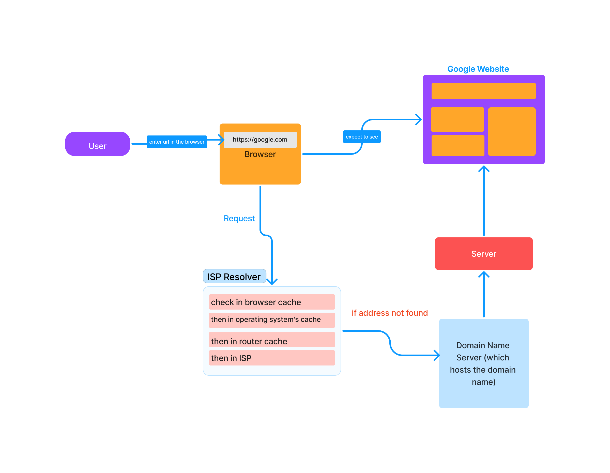
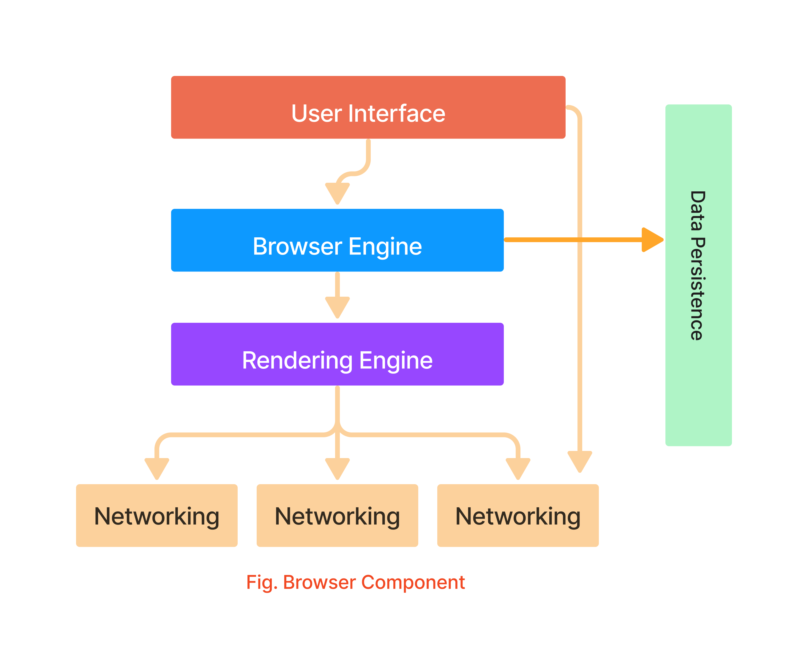
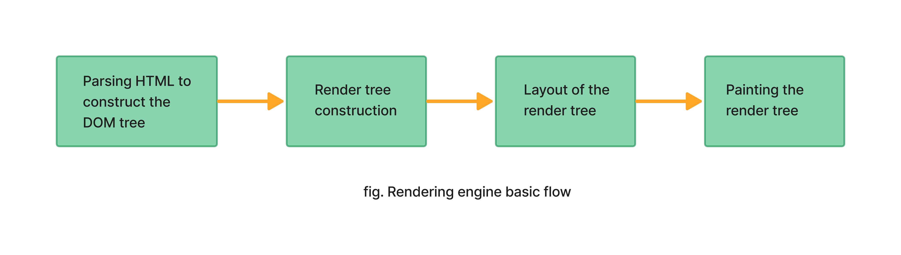
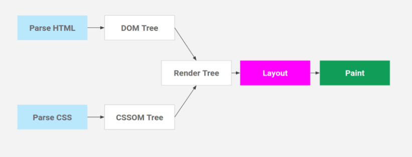
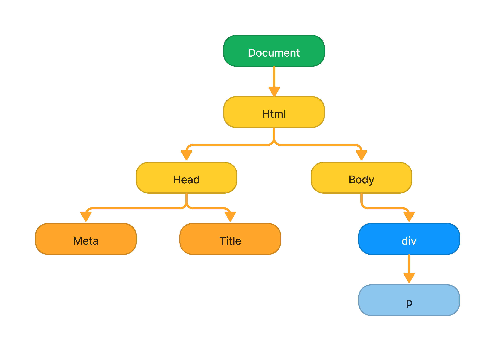
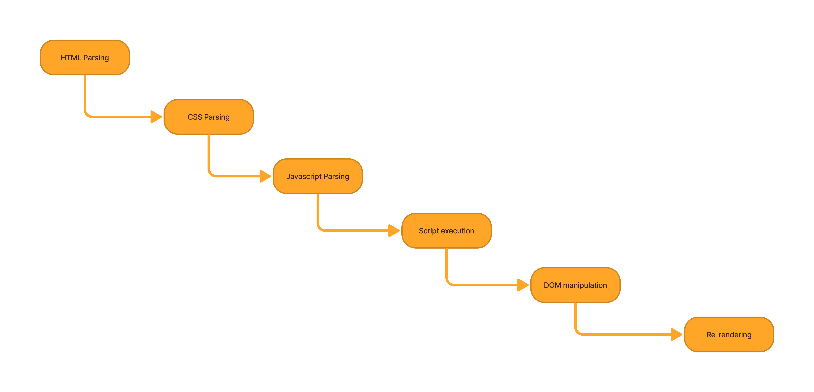

# week 1

Q. When a user enters an URL in the browser, how does the browser fetch the desired result ?

    Ans. When a user enters an URL in the browser, the browser first checks its cache for the DNS entry to find the corresponding IP 
    address of the website (domain). It checks different levels of cache starting with its own 

    - browser cache, 
    - then operating system's cache, 
    - router cache and 
    - ISP (Internet Service Provider) cache. 

    If the address is not found in any of these caches, the ISP's DNS server initiates a DNS query to find the IP 
    address of the server that hosts the domain name.



    Once the IP address is obtained, the browser sends a request to the server using the TCP (Transfer Control Protocol) connection, 
    which is established by sending synchronize (SYN) and acknowledge (ACK) messages.



    The browser then sends an HTTP request, either GET or POST, to the web server. The server on the host computer handles the request 
    and sends back a response in a format such as JSON, XML, or HTML. The server also sends out an HTTP response in a format such as JSON, 
    XML or HTML. The server also sends out an HTTP response along with the status of the response. The browser then displays the HTML 
    content and the process is completed.




## 1. What is the main functionality of the browser?
    The main functionality of a browser is to allow users to access and navigate the internet by displaying web pages and providing 
    various features such as bookmarks, history, and search.

## 2. High Level Components of a browser.
A web browser typically has the following high-level components:

    a) User Interface: The part of the browser that the user interacts with, including the address bar, navigation buttons, 
    and the display area for web pages.

    b) The browser engine: marshals actions between the UI and the rendering engine.
    
    c) Rendering Engine: The component responsible for displaying web pages on the screen. It interprets the HTML, CSS, 
    and JavaScript code and renders the page according to web standards.
    
    d) Networking: The component responsible for communicating with web servers and retrieving web resources such as HTML, 
    CSS, and JavaScript files.

    e) JavaScript Engine: The component responsible for executing JavaScript code on the web page.

    f) UI backend: Also known as the widget toolkit or GUI toolkit, is responsible for drawing basic widgets such as buttons, 
    text boxes, and windows. It provides a generic, platform-independent interface for creating and manipulating these widgets, 
    but underneath it uses the native user interface methods of the operating system to actually draw them on the screen. 
    The UI backend is responsible for handling events such as mouse clicks and keyboard input and forwarding them to the 
    appropriate widgets. It also provides layout management, which determines the size and position of widgets within a window. 
    Different browsers may use different UI backends, such as GTK+ for Firefox, and Chromium Embedded Framework (CEF) for Chrome.

    g) Data storage: Browsers store data such as cookies, cache, and browser history for convenience and faster page load. 
    Browsers also support storage mechanisms such as localStorage, IndexedDB, WebSQL and FileSystem.
    

 


## 3. Rendering engine and its use.
    A rendering engine is a component of a web browser that is responsible for displaying web pages on the screen. 
    It interprets the HTML, CSS, and JavaScript code that makes up a web page, and renders the page according to web standards.

    The rendering engine uses a set of rules and algorithms to convert the code into a visual representation of the page. 
    It starts by parsing the HTML and constructing a Document Object Model (DOM), which is a tree-like structure that represents 
    the elements and relationships between elements on the page. The rendering engine then applies the CSS styles to the elements 
    in the DOM, and calculates the layout of the page. Finally, it paints the page onto the screen, using the native graphics 
    capabilities of the operating system.

    There are different rendering engines that are used in popular browsers such as:
    - Gecko: used by Firefox.
    - Blink: used by Chrome, Opera, and other Chromium-based browsers.
    - WebKit: used by Safari and other WebKit-based browsers.
    - Trident: used by Internet Explorer.

    Each engine has its own unique set of features, capabilities, and limitations, and each browser uses one or more of 
    these engines to display web pages.



## 4. Parsers (HTML, CSS, etc)
    Parsers are responsible for interpreting and understanding the code of the web page. For example, the HTML parser reads 
    and understands the HTML code, the CSS parser reads and understands the CSS code, and the JavaScript parser reads and 
    understands the JavaScript code.




## 5. Script Processors
    The script processor is responsible for interpreting and executing the JavaScript code, and it plays a crucial role in making 
    web pages dynamic and interactive. Script processors are also used to optimize the performance of the JavaScript code, 
    by analyzing the code, and making suggestions for improvements.

    Some popular script processors are:

    - V8: used by Google Chrome and Node.js.
    - SpiderMonkey: used by Mozilla Firefox.
    - JavaScriptCore: used by Safari and WebKit-based browsers.
    - Chakra: used by Microsoft Edge.

## 6. Tree construction
    Tree construction is the process of building a tree-like structure of the web page, with the HTML elements as the nodes 
    and the relationships between them as the edges. This structure is used by the rendering engine to display the web page.

```
<!DOCTYPE html>
<html lang="en">
<head>
    <meta charset="UTF-8"> 
    <title>Document</title>
</head>
<body>
    <div>
        <p>Hello Dom Tree</p>
    </div>
</body>
</html>
```



## 7. Order of script processing
    The order of script processing in a web browser is the sequence in which the browser handles and executes JavaScript code on a web page. 
    The order of script processing is important for ensuring that the code runs correctly and that the web page behaves as intended.




## 8. Layout and Painting
    Layout and painting are the final stages of the rendering process. Layout is the process of determining the position 
    and size of all elements on the web page, and painting is the process of filling in the visual details of those elements.